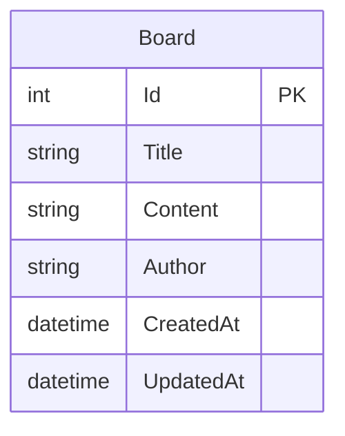

# ASP.NET Core MVC 게시판 프로젝트

ASP.NET Core MVC를 사용하여 만든 간단한 CRUD 게시판입니다.

## 기술 스택

- **Backend**: ASP.NET Core MVC 9.0
- **Database**: PostgreSQL 14
- **ORM**: Entity Framework Core
- **Frontend**: Bootstrap 5
- **View Engine**: Razor

## ERD (Entity Relationship Diagram)



## 프로젝트 구조

```
BoardProject/
├── Controllers/
│   ├── HomeController.cs
│   └── BoardController.cs
├── Models/
│   └── Board.cs
├── Views/
│   ├── Home/
│   │   └── Index.cshtml
│   ├── Board/
│   │   ├── Index.cshtml
│   │   ├── Create.cshtml
│   │   ├── Edit.cshtml
│   │   ├── Details.cshtml
│   │   └── Delete.cshtml
│   └── Shared/
│       └── _Layout.cshtml
├── Data/
│   └── ApplicationDbContext.cs
└── Program.cs
```

## API 명세서

### 게시글 관련 API

| 기능 | HTTP Method | URL | 설명 |
|------|-------------|-----|------|
| 목록 조회 | GET | /Board | 게시글 목록을 조회합니다. |
| 상세 조회 | GET | /Board/Details/{id} | 특정 게시글의 상세 내용을 조회합니다. |
| 작성 페이지 | GET | /Board/Create | 게시글 작성 페이지를 표시합니다. |
| 작성 처리 | POST | /Board/Create | 새 게시글을 생성합니다. |
| 수정 페이지 | GET | /Board/Edit/{id} | 게시글 수정 페이지를 표시합니다. |
| 수정 처리 | POST | /Board/Edit/{id} | 게시글을 수정합니다. |
| 삭제 페이지 | GET | /Board/Delete/{id} | 게시글 삭제 확인 페이지를 표시합니다. |
| 삭제 처리 | POST | /Board/Delete/{id} | 게시글을 삭제합니다. |

## 주요 컴포넌트 설명

### 1. Models

#### Board.cs
```csharp
public class Board
{
    public int Id { get; set; }                    // 게시글 고유 ID
    public string Title { get; set; }              // 제목
    public string Content { get; set; }            // 내용
    public string Author { get; set; }             // 작성자
    public DateTime CreatedAt { get; set; }        // 작성일
    public DateTime? UpdatedAt { get; set; }       // 수정일
}
```

### 2. Data

#### ApplicationDbContext.cs
- Entity Framework Core의 DbContext를 상속받아 데이터베이스 연결을 관리
- Board 엔티티에 대한 DbSet 정의

### 3. Controllers

#### BoardController.cs
- CRUD 작업을 처리하는 컨트롤러
- 비동기 방식으로 데이터베이스 작업 수행
- PRG(Post-Redirect-Get) 패턴 적용

## 데이터베이스 설정

1. PostgreSQL 설치
```bash
brew install postgresql@14
```

2. 데이터베이스 생성
```sql
CREATE DATABASE boarddb;
```

3. 연결 문자열 (appsettings.json)
```json
{
  "ConnectionStrings": {
    "DefaultConnection": "Host=localhost;Database=boarddb;Username=your_username;"
  }
}
```

## 주요 기능

1. **게시글 목록 보기**
   - 작성일 기준 내림차순 정렬
   - 게시글 번호, 제목, 작성자, 작성일 표시

2. **게시글 작성**
   - 제목, 내용, 작성자 입력
   - 유효성 검사 적용

3. **게시글 조회**
   - 상세 내용 표시
   - 작성일/수정일 표시

4. **게시글 수정**
   - 제목, 내용 수정 가능
   - 수정일 자동 업데이트

5. **게시글 삭제**
   - 삭제 전 확인 페이지 제공

## 실행 방법

1. 프로젝트 복제
```bash
git clone [repository-url]
```

2. 데이터베이스 마이그레이션 적용
```bash
dotnet ef database update
```

3. 애플리케이션 실행
```bash
dotnet run
```

4. 브라우저에서 접속
- http://localhost:5001

## 학습 포인트

1. **ASP.NET Core MVC 패턴**
   - Model: 데이터와 비즈니스 로직
   - View: 사용자 인터페이스
   - Controller: 사용자 입력 처리 및 모델-뷰 연결

2. **Entity Framework Core**
   - Code-First 접근 방식
   - 마이그레이션을 통한 데이터베이스 스키마 관리

3. **Razor View Engine**
   - C# 코드와 HTML의 통합
   - 레이아웃 시스템을 통한 일관된 UI

4. **의존성 주입**
   - DbContext 주입
   - 느슨한 결합을 통한 테스트 용이성

5. **비동기 프로그래밍**
   - async/await 패턴
   - 데이터베이스 작업의 비동기 처리 
